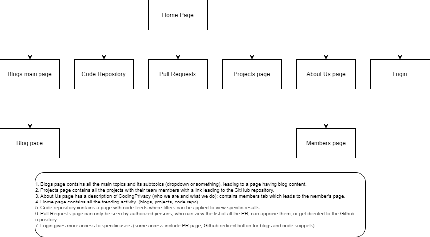

# CodingPrivacy-2.0
<h1><b>Links</b></h1>

[Jira CodingPrivacy website](https://codingprivacy.atlassian.net/jira/software/projects/CW/boards/2)

<h1><b>GitHub</b></h1>

1. Each commit message starts with an issue number.
2. Single task, single commit.
3. Each task is a new branch.
4. Code must be reviewed by another person before merging, other person reviews and merge the code.

<h1><b>Sitemap</b></h1>

1. Blogs page contains all the main topics and its subtopics (dropdown or something), leading to a page having blog content. 
2. Projects page contains all the projects with their team members with a link leading to the GitHub repository. 
3. About Us page has a description of CodingPrivacy (who we are and what we do); contains members tab which leads to the member's page. 
4. Home page contains all the trending activity. (blogs, projects, code repo)
5. Code repository contains a page with code feeds where filters can be applied to view specific results.
6. Pull Requests page can only be seen by authorized persons, who can view the list of all the PR, can approve them, or get directed to the Github repository. 
7. Login gives more access to specific users (some access include PR page, Github redirect button for blogs and code snippets).
8. We can create new code repo feeds and blogs on the website and raise a PR.